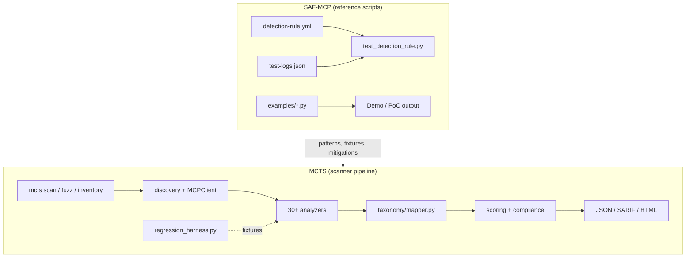

# Script-to-Script Comparison: SAF-MCP vs MCTS

> **Last synced:** 2025-06 — MCTS uses first-party `MCTS-T-*` / `MCTS-M-*` IDs only (no `saf_technique_id` on findings). Regression fixtures live under `tests/fixtures/regression/`; CI gate via `regression_harness.py`.

**Sources analyzed**

| Project | Path | Role |
|---------|------|------|
| **SAF-MCP** | `competitors/saf-mcp-main/` (upstream reference) | OpenSSF threat-intelligence framework (markdown TTPs + reference detection artifacts) |
| **MCTS** | Repository root | Model Context Threat Scanner — executable CLI audit pipeline |

This document compares **executable Python** in both trees: MCTS analyzers, fuzz/probe/discovery modules, and CLI vs SAF-MCP `test_detection_rule.py` harnesses, `examples/` PoCs, and mitigation reference code. SAF IDs appear **only when describing upstream artifacts**; MCTS sections use the native taxonomy in `src/mcts/taxonomy/techniques.json` and `docs/taxonomy.md`.

---

## 1. Executive Summary

SAF-MCP and MCTS solve **different problems** with **different script shapes**:

| | SAF-MCP scripts | MCTS scripts |
|---|-----------------|--------------|
| **Count** | 44 Python files (~9.5k LOC), 72 Sigma YAML, 78 technique READMEs | 60+ Python modules under `src/mcts/`; **41** `MCTS-T-*` techniques, **25** `MCTS-M-*` mitigations |
| **Purpose** | Validate Sigma rules, demonstrate attacks/defenses, teach detection patterns | Discover MCP servers, statically analyze source/metadata, optionally live-probe, score, report |
| **Input** | NDJSON log fixtures (`test-logs.json`), sample tool JSON, synthetic conversations | Repo paths, MCP configs, live stdio servers, bundled regression fixtures |
| **Output** | Pass/fail test summaries, demo prints | `Finding` objects → JSON / SARIF / HTML dashboard (`technique_id`, `mitigation_ids`) |
| **Runtime** | None required (offline scripts) | Full CLI with discovery, consent gates, CI exit codes |

**Overlap is conceptual, not architectural.** The closest apples-to-apples comparison is:

```
SAF-T1001/examples/tpa-detector.py  ↔  MCTS tpa_patterns.py + prompt_injection + metadata_integrity + sigma_metadata
SAF-T1105/test_detection_rule.py    ↔  MCTS path_traversal.py + path_validation + tool_abuse (+ fuzz payloads)
SAF-M-63/embedding_sanitization.py  ↔  MCTS embedding_secrets.py (opt-in via --semantic-secrets)
```

MCTS ships **41 internal `MCTS-T-*` IDs** and **25 `MCTS-M-*` mitigations** in `src/mcts/taxonomy/techniques.json`. SAF-MCP documents **~85 `SAF-T-*` techniques**. MCTS regression-gates **34 techniques at ≥80%** detector accuracy in CI (`tests/fixtures/regression/MCTS-T-*/`, `src/mcts/testing/regression_harness.py`) — roughly **45%** of the upstream catalog by technique count, with broader static/live coverage than the matrix below suggests for un-gated IDs.

---

## 2. Repository Script Inventory

### 2.1 SAF-MCP Python layout

```
saf-mcp-main/
├── techniques/SAF-TXXXX/
│   ├── detection-rule.yml          # 72 techniques — Sigma reference rules
│   ├── test-logs.json              # 38 techniques — NDJSON fixtures
│   ├── test_detection_rule.py      # 33 techniques — Sigma ↔ fixture validator
│   └── examples/*.py               #  6 techniques — standalone PoC detectors/demos
└── mitigations/SAF-M-63/
    └── embedding_sanitization.py   #  1 mitigation — vector/credential sanitization
```

**SAF-MCP Python by category**

| Category | Files | Lines (approx.) | Function |
|----------|-------|-----------------|----------|
| `test_detection_rule.py` | 33 | ~7,200 | Load Sigma YAML, match NDJSON logs, assert expected detections |
| `examples/` PoCs | 10 | ~3,500 | Standalone detectors (TPA, behavioral, embeddings, vector poisoning, model poisoning) |
| Mitigation reference | 1 | 360 | Credential/embedding sanitization for vector stores |
| **Total** | **44** | **~9,500** | Reference / educational — not a unified scanner |

Techniques **with** `examples/` Python (the highest-fidelity script peers for MCTS):

| Technique | Script(s) | Detection paradigm |
|-----------|-----------|-------------------|
| SAF-T1001 TPA | `tpa-detector.py` | Static metadata scan (description + recursive schema) |
| SAF-T1505 In-Memory Secret Extraction | `detection_embeddings.py`, `detection_clustering.py` | Semantic similarity / clustering |
| SAF-T1603 System Prompt Disclosure | `detection_behavioral.py`, `detection_guard_model.py` | Multi-turn conversation analysis |
| SAF-T2106 Context Memory Poisoning | `vector-store-poisoning-demo.py`, `working-demo.py` | Vector DB contamination demo |
| SAF-T2107 AI Model Poisoning | `training-data-poisoning-demo.py`, `defense-mechanisms-demo.py`, `working-demo.py` | Training-data backdoor demo |

All other SAF techniques ship Sigma + optional test harness only — **no runnable static analyzer** equivalent to MCTS.

### 2.2 MCTS Python layout (scan-relevant)

```
src/mcts/
├── cli/main.py                 # Typer CLI: scan, inventory, fuzz, report
├── core/scanner.py             # Orchestrates analyzers → enrich → score → report
├── analyzers/*.py              # 30+ static + runtime analyzers (see §4)
├── discovery/*.py              # Static Python/JS tool discovery from repos
├── inventory/*.py              # Client config discovery (Cursor, Claude Desktop, …)
├── fuzz/*.py                   # Live MCP protocol fuzz (consent-gated)
├── probe/*.py                  # Live stdio MCP session + behavioral probe
├── testing/regression_harness.py  # 34-technique fixture evaluator (≥80% CI gate)
├── mcp/client.py               # MCP discovery client
├── taxonomy/
│   ├── techniques.json         # MCTS-T-* + MCTS-M-* catalog
│   ├── mapper.py               # technique_id / mitigation_ids enrichment
│   └── sigma/metadata_rules.json  # Bundled metadata Sigma patterns
├── reporting/sarif.py          # SARIF export with technique_id + mitigation_ids
└── scoring/engine.py           # Risk scoring
```

MCTS has **no equivalent** to per-technique Sigma YAML co-located with dossiers. Regression fixtures are vendored under `tests/fixtures/regression/MCTS-T-*/` (neutral IDs); pytest lives in `tests/test_technique_regression.py`.

---

## 3. Execution Model Comparison



| Stage | SAF-MCP | MCTS |
|-------|---------|------|
| **Ingest** | Human reads README; scripts load local YAML/JSON | `discovery/static*.py` parses Python/TS MCP servers; `inventory/` reads client configs |
| **Analyze** | Regex/wildcard on log fields OR demo class methods | AST + regex on source; metadata scan on `MCPTool`; optional live fuzz |
| **Validate** | `test_detection_rule.py` exit code | `tests/test_*.py` pytest |
| **Report** | stdout pass/fail | Structured `Finding` + severity + `technique_id` + remediation |
| **Gate CI** | Optional per-technique script | `--fail-on-critical`, `--min-score`, SARIF upload |

**Critical paradigm difference:** most SAF Sigma rules assume **runtime telemetry** (`tool_description`, `path`, `oauth_token`, `event_type: file_access`). MCTS primarily performs **pre-deployment static analysis** on source and tool metadata discovered from repos. SAF-T1105 path traversal rules target **log fields at invocation time**; MCTS `path_validation.py` inspects **handler source** for missing `realpath`/`resolve` calls. Both are valid layers; they are not drop-in substitutes.

---

## 4. Analyzer-by-Analyzer Script Mapping

### 4.1 Tool Poisoning & Metadata (Initial Access)

| MCTS module | LOC | SAF peer scripts | SAF technique IDs | Coverage comparison |
|-------------|-----|------------------|-------------------|---------------------|
| `prompt_injection.py` | 114 | `SAF-T1001/examples/tpa-detector.py`, `SAF-T1001/test_detection_rule.py` | SAF-T1001, SAF-T1402 | MCTS: hidden Unicode (`\u200b–\u202e`), instruction-like regex, desc/handler mismatch, risky keywords. **Missing vs SAF:** HTML comments (`<!-- SYSTEM:`), LLM template markers (`[INST]`, `<\|system\|>`, `### Instruction:`), homoglyphs (Cyrillic/Latin), Unicode tag block (U+E0000–E007F), mixed-script detection, recursive schema enum scanning |
| `metadata_integrity.py` | 90 | Same as above + SAF-T1401 (line jumping) | SAF-T1001, SAF-T1401 | MCTS: poison regex (ignore instructions, credential requests, authority claims), excessive description length (>500). **Missing vs SAF:** HTML comment steganography, consent-fatigue patterns (SAF-T1403), response tampering (SAF-T1404) |
| `schema_surface.py` | 89 | `tpa-detector.py` `_scan_schema()`, SAF-T1501 FSP dossier | SAF-T1001.002 / SAF-T1501 | MCTS: credential param names, suspicious defaults, optional dangerous params. **Missing vs SAF:** recursive property-name injection scan, enum value poisoning, nested schema description scan |

**Pattern diff — SAF-T1001 Sigma vs MCTS regex**

SAF Sigma (`detection-rule.yml`) patterns:

```yaml
- '*<!-- SYSTEM:*'
- '*<|system|>*'
- '*[INST]*'
- '*### Instruction:*'
- '*\u200b*' … '*\u202E*'
- '*\uE00*'
```

MCTS `prompt_injection.py` covers Unicode subset and generic imperatives but **does not** implement HTML-comment or chat-template markers. Importing SAF's pattern list into `metadata_integrity.POISON_PATTERNS` is the lowest-effort win.

**Sub-technique mapping**

| SAF sub-technique | MCTS finding | Gap |
|-------------------|--------------|-----|
| SAF-T1001.001 Description poisoning | `inject-*`, `meta-poison-*` | Partial — add SAF patterns |
| SAF-T1001.002 Full-schema poisoning | `schema-*` | Partial — add recursive schema walk from `tpa-detector.py` |
| SAF-T1402 Instruction steganography | hidden Unicode only | Gap — HTML/ZWSP combos |
| SAF-T1401 Line jumping | excessive description length | Partial — no multi-checkpoint narrative detection |

---

### 4.2 Path Traversal & File Tools (Execution / Collection)

| MCTS module | LOC | SAF peer | SAF IDs | Comparison |
|-------------|-----|----------|---------|------------|
| `tool_abuse.py` | 44 | `SAF-T1105/test_detection_rule.py` | SAF-T1105, SAF-T1606 | MCTS flags file tools by name heuristic + static payload list (`../../etc/passwd`, `~/.aws/credentials`). Does **not** execute payloads. SAF validates **encoded traversal strings** in runtime logs: `%2e%2e%2f`, double encoding, `%c0%ae` overlong UTF-8, null bytes, sensitive path targets |
| `path_validation.py` | 51 | Same | SAF-T1105 | MCTS checks handler source for canonicalization hints (`resolve`, `realpath`, `abspath`, `normpath`, `is_relative_to`). Complementary to SAF — catches **missing guards** pre-deploy; SAF catches **exploit attempts** at runtime |

**Adopt from SAF-T1105 `test_detection_rule.py`:**

- Expand `TRAVERSAL_PAYLOADS` in `tool_abuse.py` / fuzz module with SAF's 15+ encoding variants
- Add sensitive-path regex list from `is_path_traversal_attempt()` (lines 358–379 of SAF script)
- Use SAF `NEGATIVE_TEST_CASES` as regression fixtures in `tests/test_analyzers.py` to reduce false positives on `src/`, `docs/`, `tests/` paths

---

### 4.3 Command Execution (Execution)

| MCTS module | LOC | SAF peer | SAF IDs | Comparison |
|-------------|-----|----------|---------|------------|
| `command_execution.py` | 118 | `SAF-T1101` dossier + Sigma (no dedicated test script) | SAF-T1101, SAF-T1104 | MCTS uses AST walk for `subprocess`, `os.system`, `eval`, `exec` in tool handlers. SAF-T1101 is documentation-first; Sigma targets runtime command strings. **Gap:** SAF-T1104 over-privileged tool abuse (capability vs OS rights) — MCTS `permissions.py` partially covers via capability model |

---

### 4.4 Cross-Server / Tool Shadowing (Initial Access / Privilege Escalation)

| MCTS module | LOC | SAF peer | SAF IDs | Comparison |
|-------------|-----|----------|---------|------------|
| `cross_server.py` | 91 | `SAF-T1008/test_detection_rule.py`, `SAF-T1301/test_detection_rule.py` | SAF-T1008, SAF-T1301 | MCTS: exact name collision + 85% similar names across `inventory` entries. SAF Sigma: OAuth/tool-registry log patterns for cross-server interference. MCTS is **static config analysis**; SAF is **runtime registry telemetry** — aligned intent, different data plane |

---

### 4.5 Secrets & Data Leakage (Credential Access / Collection)

| MCTS module | LOC | SAF peer | SAF IDs | Comparison |
|-------------|-----|----------|---------|------------|
| `data_leakage.py` | 116 | `SAF-M-63/embedding_sanitization.py`, `SAF-T1505/examples/*`, `SAF-T1503/test_detection_rule.py` | SAF-T1502–1505, SAF-T1503 | MCTS: regex for OpenAI/AWS keys, secret assignments, DB URLs, env var name references, hidden chars in source. SAF-M-63 adds **10+ credential types** (Google, Slack, GitHub PAT, GitLab, JWT), semantic embedding similarity, vector-store sanitization. **Large gap** on semantic/obfuscated credential hunting |

**Credential patterns in SAF-M-63 not in MCTS today:**

```python
GOOGLE_API_KEY = r'AIza[0-9A-Za-z\-_]{35}'
SLACK_TOKEN = r'xoxb-[0-9]{10,13}-...'
GITHUB_PAT = r'ghp_[a-zA-Z0-9]{36}'
GITLAB_PAT = r'glpat-[a-zA-Z0-9\-_]{20,}'
GENERIC_JWT = r'eyJ[a-zA-Z0-9\-_]+\.eyJ...'
```

---

### 4.6 Agent Manipulation & Jailbreak (Defense Evasion / Execution)

| MCTS module | LOC | SAF peer | SAF IDs | Comparison |
|-------------|-----|----------|---------|------------|
| `jailbreak.py` | 61 | `SAF-T1603/examples/detection_behavioral.py`, `SAF-T1102` dossier | SAF-T1102, SAF-T1603, SAF-T1309 | MCTS: weighted score from tool count, execution capabilities, schema gaps. SAF-T1603: multi-turn meta-question frequency, sycophancy exploitation, time-windowed pattern analysis. **No overlap in implementation** — SAF is conversational runtime; MCTS is static surface scoring |

---

### 4.7 Attack Chains (Impact / Lateral Movement)

| MCTS module | LOC | SAF peer | SAF IDs | Comparison |
|-------------|-----|----------|---------|------------|
| `attack_chains.py` | 171 | `SAF-T1701`, `SAF-T1703`, `SAF-T1705` dossiers | SAF-T1701–1707 | MCTS builds read→exec→egress chains from capability tags. SAF documents cross-tool contamination, tool-chaining pivots, cross-agent injection — **narrative + Sigma**, no Python chain engine. MCTS is ahead on automated graph construction |

---

### 4.8 Permissions (Privilege Escalation)

| MCTS module | LOC | SAF peer | SAF IDs | Comparison |
|-------------|-----|----------|---------|------------|
| `permissions.py` | 64 | `SAF-T1104/test_detection_rule.py`, `SAF-T1302/test_detection_rule.py` | SAF-T1104, SAF-T1302, SAF-T1309 | MCTS flags broad filesystem/network/exec capabilities. SAF focuses on runtime abuse of legit high-priv tools |

---

### 4.9 Live Fuzz & Protocol (Execution / Discovery)

| MCTS module | LOC | SAF peer | SAF IDs | Comparison |
|-------------|-----|----------|---------|------------|
| `fuzz/runner.py` + `payloads.py` | 285 | `SAF-T1601/test_detection_rule.py`, `SAF-T1602`, `SAF-T1112/test_detection_rule.py` | SAF-T1601–1602, SAF-T1112 | MCTS sends consent-gated MCP JSON-RPC probes (malformed schema, boundary values). SAF Sigma targets enumeration logs and `sampling/createMessage` abuse. **Complementary** — MCTS could add SAF-T1112 sampling probes to `payloads.py` |

---

### 4.10 Infrastructure MCTS Has; SAF Does Not

These modules have **no SAF script counterpart** — they are MCTS differentiators:

| MCTS module | Function |
|-------------|----------|
| `discovery/static.py`, `static_js.py` | Parse `@mcp.tool` decorators from Python/TypeScript without running server |
| `inventory/discoverers.py` | Find MCP configs in IDE client paths |
| `probe/session.py` | Live stdio MCP handshake with consent |
| `cli/main.py` | Unified CLI, CI gates, HTML/SARIF export |
| `scoring/engine.py` | Quantitative risk score |
| `compliance/checks.py` | Policy checks layered on findings |
| `reporting/sarif.py` | SARIF 2.1.0 with `technique_id` property |

---

## 5. Full Technique Coverage Matrix

Legend: **●** MCTS regression-gated (≥80% in CI) · **◐** partial / related · **○** SAF documents only · **★** SAF has Sigma + test script

| Upstream SAF ID | Technique (short) | MCTS ID | MCTS | SAF scripts | MCTS analyzer / note |
|-----------------|-------------------|---------|------|-------------|----------------------|
| SAF-T1001 | Tool Poisoning Attack | MCTS-T-1001 | ● | ★ `tpa-detector.py` | `prompt_injection`, `metadata_integrity`, `sigma_metadata`, `tpa_patterns` |
| SAF-T1501 / T1001.002 | Full-Schema Poisoning | MCTS-T-1001.002 | ● | ★ | `schema_surface`, `schema_fsp` |
| SAF-T1002 | Supply Chain Compromise | MCTS-T-1014 | ● | ★ | `supply_chain`, `supply_chain_signals` |
| SAF-T1003 | Malicious MCP Server Distribution | MCTS-T-1015 | ● | ★ | `supply_chain`, `supply_chain_signals` |
| SAF-T1004 | Server Impersonation | MCTS-T-1028 | ● | ★ | `dns_poisoning`, `runtime_events` |
| SAF-T1005 | Exposed Endpoint | MCTS-T-1027 | ● | ★ | `exposed_endpoint`, `runtime_events` |
| SAF-T1006 | Suspicious Tool Registration | MCTS-T-1031 | ● | ◐ | `suspicious_registration`, `runtime_events` |
| SAF-T1007 | OAuth Authorization Phishing | MCTS-T-1011 | ● | ◐ | `oauth_config`, `oauth_phishing` |
| SAF-T1008 | Tool Shadowing | MCTS-T-1020 | ● | ★ | `tool_shadowing`, `cross_server` |
| SAF-T1009 | Authorization Server Mix-up | MCTS-T-1012 | ● | ★ | `oauth_config`, `oauth_mixup`, `runtime_events` |
| SAF-T1101 | Command Injection | MCTS-T-1023 | ● | ○ | `command_injection`, `command_execution`, `runtime_events` |
| SAF-T1102 | Tool Output Prompt Injection | MCTS-T-1007 | ● | ○ | `tool_output_injection`, `jailbreak`, `runtime_events` |
| SAF-T1103 | Fake Tool Invocation | MCTS-T-1032 | ● | ○ | `fake_tool_invocation`, `runtime_events` |
| SAF-T1104 | Over-Privileged Tool Abuse | MCTS-T-1006 | ● | ★ | `over_privileged`, `permissions`, `runtime_events` |
| SAF-T1105 | Path Traversal via File Tool | MCTS-T-1002 | ● | ★ | `path_traversal`, `path_validation`, `tool_abuse` |
| SAF-T1106 | Autonomous Loop Exploit | MCTS-T-1035 | ● | ★ | `autonomous_loop`, `runtime_events` |
| SAF-T1109 | MCP Inspector RCE | MCTS-T-1036 | ● | ★ | `inspector_rce`, `runtime_events` |
| SAF-T1110 | Multimodal Prompt Injection | — | ○ | ★ | Not implemented |
| SAF-T1111 | AI Agent CLI Weaponization | — | ○ | ◐ | Not implemented |
| SAF-T1112 | Sampling Request Abuse | MCTS-T-1016 | ● | ★ | `sampling_abuse`, `fuzz`, `runtime_events` |
| SAF-T1201 | MCP Rug Pull | MCTS-T-1013 | ● | ★ | `rug_pull`, `metadata_diff`, `runtime_events` |
| SAF-T1202 | OAuth Token Persistence | MCTS-T-1037 | ● | ★ | `oauth_token_persistence`, `runtime_events` |
| SAF-T1203 | Backdoored Install | MCTS-T-1038 | ● | ★ | `backdoored_install`, `runtime_events` |
| SAF-T1204 | Context Memory Implant | MCTS-T-1039 | ● | ★ | `context_memory_implant`, `runtime_events` |
| SAF-T1205 | Persistent Tool Redefinition | MCTS-T-1040 | ● | ★ | `tool_redefinition`, `metadata_diff`, `runtime_events` |
| SAF-T1206–1207 | Other persistence | — | ○ | ★ partial | Not implemented |
| SAF-T1301 | Cross-Server Shadowing | MCTS-T-1029 | ● | ★ | `cross_server_registry`, `cross_server`, `runtime_events` |
| SAF-T1302 | High-Privilege Tool Abuse | MCTS-T-1030 | ● | ★ | `privilege_tool_abuse`, `runtime_events` |
| SAF-T1303 | Container Sandbox Escape | MCTS-T-1033 | ● | ★ | `sandbox_escape`, `runtime_events` |
| SAF-T1306 | Rogue Authorization Server | MCTS-T-1017 | ● | ★ | `oauth_escalation_runtime`, `oauth_config` |
| SAF-T1307 | OAuth Confused Deputy | MCTS-T-1018 | ● | ★ | `oauth_escalation_runtime`, `oauth_config` |
| SAF-T1308 | Token Scope Substitution | MCTS-T-1019 | ● | ★ | `oauth_escalation_runtime`, `oauth_config` |
| SAF-T1309 | Other OAuth escalation | — | ◐ | ★ partial | Partially covered by OAuth cluster |
| SAF-T1401 | Line Jumping | MCTS-T-1021 | ● | ★ | `line_jumping` |
| SAF-T1402 | Instruction Steganography | MCTS-T-1041 | ● | ★ | `instruction_steganography`, `tpa_patterns`, `runtime_events` |
| SAF-T1403–1408 | Other defense evasion | — | ◐ | ★ partial | Unicode/HTML partial via `tpa_patterns` |
| SAF-T1502 | Credential File Access | MCTS-T-1024 | ● | ★ | `credential_access`, `runtime_events` |
| SAF-T1505 | Semantic Credential Exposure | MCTS-T-1022 | ◐ | ★ examples | `embedding_secrets` (opt-in `--semantic-secrets`) |
| SAF-T1501–1507 (other) | Credential access | ◐ | ★ partial | `data_leakage`, `schema_surface` |
| SAF-T1603 | System Prompt Disclosure | MCTS-T-1026 | ● | ★ behavioral | `behavioral_extraction`, `probe/behavioral`, `runtime_events` |
| SAF-T1601–1602, T1604–1606 | Discovery | ◐ | ★ partial | `fuzz`, discovery |
| SAF-T1701–1707 | Lateral movement | ◐ | ★ partial | `attack_chains` |
| SAF-T1801–1805 | Collection | ◐ | ◐ | `data_leakage`, `tool_abuse` |
| SAF-T1901–1904 | C2 | ○ | ◐ | Not implemented |
| SAF-T1910–1915 | Exfiltration | ○ | ★ | Not implemented |
| SAF-T2106 | Vector Store Poisoning | MCTS-T-1034 | ● | ★ examples | `vector_poisoning`, `runtime_events` |
| SAF-T2101–2105, T3001 | Impact / RAG backdoor | ○ | ★ partial | Not implemented |
| SAF-T2107 | AI Model Poisoning | ○ | ★ examples | Demo only in SAF |

**Scorecard (updated):** **34** techniques regression-gated in CI at ≥80%; **41** `MCTS-T-*` entries in taxonomy; **~50+** upstream SAF techniques still without regression fixtures or dedicated analyzers.

---

## 6. MCTS Taxonomy (first-party)

MCTS findings expose **`technique_id`** (`MCTS-T-*`) and **`mitigation_ids`** (`MCTS-M-*`) only. Enrichment runs via `taxonomy/mapper.py` from `techniques.json`. Reports link to `docs/taxonomy.md` — not upstream dossier URLs.

### 6.1 Regression-gated techniques (34)

These IDs have bundled fixtures under `tests/fixtures/regression/MCTS-T-*/` and must stay ≥80% accurate in CI:

`MCTS-T-1001`, `1001.002`, `1002`, `1006`, `1007`, `1011`, `1012`, `1013`, `1014`, `1015`, `1016`, `1017`, `1018`, `1019`, `1020`, `1021`, `1023`, `1024`, `1026`, `1027`, `1028`, `1029`, `1030`, `1031`, `1032`, `1033`, `1034`, `1035`, `1036`, `1037`, `1038`, `1039`, `1040`, `1041`

### 6.2 Core catalog sample (technique → mitigations)

| MCTS-T ID | Primary analyzer(s) | MCTS-M mitigations (from catalog) |
|-----------|-------------------|-----------------------------------|
| MCTS-T-1001 | `prompt_injection`, `metadata_integrity` | MCTS-M-004, M-007, M-020 |
| MCTS-T-1001.002 | `schema_surface` | MCTS-M-021 |
| MCTS-T-1002 | `path_validation`, `path_traversal`, `tool_abuse` | MCTS-M-001, M-021 |
| MCTS-T-1003 | `command_execution` | MCTS-M-002, M-013 |
| MCTS-T-1007 | `tool_output_injection`, `jailbreak`, `runtime_events` | MCTS-M-004, M-012 |
| MCTS-T-1010 | `sigma_metadata` | MCTS-M-020 |
| MCTS-T-1011–1019 | `oauth_config`, `runtime_events` | MCTS-M-014–M-019 |
| MCTS-T-1013 | `rug_pull`, `metadata_diff` | MCTS-M-022, M-024 |
| MCTS-T-1014 / 1015 | `supply_chain` | MCTS-M-008, M-010, M-018 |
| MCTS-T-1022 | `embedding_secrets` | MCTS-M-025 |
| MCTS-T-1040 | `tool_redefinition`, `metadata_diff` | MCTS-M-022 |
| MCTS-T-1041 | `instruction_steganography` | MCTS-M-007, M-009 |

Full table: `src/mcts/taxonomy/techniques.json` (41 techniques, 25 mitigations).

### 6.3 Optional upstream cross-reference (research only)

When comparing to SAF-MCP dossiers for gap analysis, use this **informal** mapping — not emitted in scan output:

| MCTS-T ID | Informative upstream peer |
|-----------|---------------------------|
| MCTS-T-1001 | SAF-T1001, SAF-T1402 |
| MCTS-T-1002 | SAF-T1105 |
| MCTS-T-1013 | SAF-T1201 |
| MCTS-T-1040 | SAF-T1205 |
| MCTS-T-1034 | SAF-T2106 |

Do **not** reintroduce `saf_technique_id` fields on `Finding`; external frameworks belong in competitor docs or optional `evidence` tags, not the product taxonomy.

---

## 7. Everything You Can Take From SAF-MCP

Organized by **effort** and **impact**.

### 7.1 Quick wins (hours — port patterns & fixtures)

| # | Take from SAF | Port into MCTS | Status |
|---|---------------|----------------|--------|
| 1 | TPA Sigma pattern list | `tpa_patterns.py` + `sigma_metadata` | ✅ Shipped |
| 2 | HTML / template injection regex | `tpa_patterns.py`, `prompt_injection.py` | ✅ Shipped |
| 3 | Homoglyph + mixed-script detection | `tpa_patterns.find_homoglyphs()` | ✅ Shipped |
| 4 | Unicode tag block scan (U+E0000–E007F) | `tpa_patterns.has_control_chars()` | ✅ Shipped |
| 5 | Recursive schema walker | `schema_fsp.py`, `schema_surface.py` | ✅ Partial |
| 6 | Expanded credential regex set | `data_leakage.py`, `embedding_secrets.py` | ✅ Shipped |
| 7 | Path traversal encoding payloads | `path_traversal.py` + fuzz | ✅ Shipped |
| 8 | NDJSON test fixtures | `tests/fixtures/regression/MCTS-T-*/` | ✅ Shipped (34 IDs) |
| 9 | Sigma wildcard → regex converter | `taxonomy/sigma/matcher.py` | ✅ Shipped |
| 10 | False-positive negative cases | `tests/test_technique_regression.py` | ✅ Shipped |

### 7.2 Medium effort (days — new analyzers or modules)

| # | Take from SAF | MCTS module to add/extend | Rationale |
|---|---------------|---------------------------|-----------|
| 11 | Sigma rule corpus (72 YAML) | `analyzers/sigma_metadata.py` + `taxonomy/sigma/metadata_rules.json` | ✅ Shipped — compile via `scripts/compile_sigma_rules.py` |
| 12 | OAuth technique dossiers | `analyzers/oauth_config.py` + runtime OAuth cluster | ✅ MCTS-T-1011–1019 |
| 13 | Sampling abuse patterns | `fuzz/payloads.py`, `sampling_abuse.py` | ✅ MCTS-T-1016 |
| 14 | Rug pull / persistent redefinition | `metadata_diff.py`, `tool_redefinition.py` | ✅ MCTS-T-1013, MCTS-T-1040 |
| 15 | Supply chain | `supply_chain.py`, `supply_chain_signals.py` | ✅ MCTS-T-1014, MCTS-T-1015 |
| 16 | Per-finding mitigation links | `report/data.py`, HTML dashboard | ✅ `MCTS-M-*` via `mitigation_urls.py` → `docs/taxonomy.md` |
| 17 | ATT&CK tags | SARIF `taxa` field | ✅ `evidence.attack_tags` + `technique_id` |

### 7.3 Strategic adoption (weeks — differentiated capability)

| # | Take from SAF | Implementation sketch | Techniques addressed |
|---|---------------|----------------------|---------------------|
| 18 | Embedding-based credential detection | Optional analyzer using `sentence-transformers` (SAF-M-63 model: `all-MiniLM-L6-v2`) | SAF-T1505, T1501, T1102 |
| 19 | Behavioral multi-turn detector | Live-mode optional module; session transcript input | SAF-T1603 |
| 20 | Vector-store poisoning checks | Integrate with RAG MCP servers if detected | SAF-T2106, T2107 |
| 21 | Sigma → MCTS rule compiler | CI job: SAF repo submodule, compile YAML to Python/regex rules | All 72 Sigma rules |
| 22 | OpenSSF SIG alignment | Publish MCTS finding statistics mapped to SAF-T gaps; contribute back test fixtures | Community / governance |

### 7.4 Process & governance to adopt (no code required)

| Asset | Value for MCTS |
|-------|----------------|
| `techniques/TEMPLATE.md` + `TEMPLATE-CHECKLIST.md` | Structure for MCTS's own technique docs if publishing a lighter taxonomy |
| `MITIGATIONS.md` index (47 controls) | Remediation boilerplate in HTML reports |
| `ID-MAP.md` | Stable IDs when referencing legacy `SAFE-*` citations in papers |
| Dual license (Apache-2.0 + CC-BY-4.0) | Pattern reference and short regex lists are safe to adapt; attribute per `CONTRIBUTING.md` |
| OpenSSF SIG-SAFE-MCP meetings / mailing list | Early warning for new techniques (e.g., SAF-T1112) before scanner coverage lag |

### 7.5 What NOT to port blindly

| SAF artifact | Why caution |
|--------------|-------------|
| Runtime Sigma rules applied to static source | Log field names (`tool_name`, `path`, `result`) don't exist in repo scans — adapt patterns to metadata/source context |
| `detection_behavioral.py` thresholds | Tuned for conversation logs, not tool manifests — needs recalibration |
| Vector/model poisoning demos | Educational attack code — do not bundle into scanner; use as test vectors only |
| Index-only techniques (SAF-T1206, T1405, …) | No scripts or dossiers yet — watch SIG for maturity |

---

## 8. Side-by-Side: TPA Detection Logic

The richest script-to-script comparison in the entire SAF corpus is **TPA detection**.

### SAF `tpa-detector.py` scan flow

```
scan_tool(tool)
  ├─ _scan_text(description)
  │    ├─ suspicious_patterns (HTML, [INST], ### Instruction, …)
  │    ├─ invisible_chars dict (20+ codepoints)
  │    ├─ unicode_tags U+E0000–E007F
  │    ├─ homoglyphs Cyrillic/Latin
  │    ├─ mixed scripts
  │    └─ control chars (Cc, Cf)
  ├─ _scan_schema(inputSchema)  [recursive]
  │    ├─ suspicious defaults
  │    ├─ property names + descriptions
  │    └─ enum values
  └─ _scan_text(name)
```

### MCTS equivalent (split across 3 analyzers)

```
PromptInjectionAnalyzer._analyze_tool
  ├─ HIDDEN_CHAR_PATTERN (subset of SAF invisible_chars)
  ├─ INSTRUCTION_LIKE regex
  ├─ _description_handler_mismatch
  └─ risky_keywords tuple

MetadataIntegrityAnalyzer._analyze_tool
  ├─ POISON_PATTERNS (4 regexes — overlaps SAF suspicious_patterns partially)
  └─ EXCESSIVE_LENGTH > 500

SchemaSurfaceAnalyzer._analyze_tool
  ├─ CREDENTIAL_PARAM_NAMES
  ├─ SUSPICIOUS_DEFAULTS
  └─ optional dangerous params (non-recursive)
```

**Status:** ✅ Implemented via shared `src/mcts/analyzers/tpa_patterns.py`, consumed by `prompt_injection`, `metadata_integrity`, `schema_surface`, and `sigma_metadata` (with dedupe in `sigma_dedupe.py`).

---

## 9. Test Harness Comparison

| Aspect | SAF `test_detection_rule.py` | MCTS regression harness |
|--------|------------------------------|-------------------------|
| Location | Co-located per technique | `src/mcts/testing/regression_harness.py` |
| Fixtures | `techniques/SAF-TXXXX/test-logs.json` | `tests/fixtures/regression/MCTS-T-*/` |
| Pytest entry | Manual / contributor-run | `tests/test_technique_regression.py` |
| Input | Sigma YAML + NDJSON logs | Same log shapes, neutral directory names |
| Assertion | Hardcoded `expected.json` per case | `RegressionCase.expect` vs detector bool |
| CI gate | Optional per-technique script | `.github/workflows/ci.yml` — all 34 IDs ≥80% |
| Artifact | stdout | `regression-report.json` (uploaded from CI) |
| Pattern converter | `convert_sigma_pattern_to_regex()` | `taxonomy/sigma/matcher.py` |

**Status:** ✅ Shipped. Do not rename fixtures back to `SAF-T*` paths — keep MCTS-first IDs for product de-identification.

---

## 10. Licensing Notes for Borrowing Code

| SAF-MCP content | License | MCTS adoption |
|-----------------|---------|---------------|
| Technique READMEs | CC-BY-4.0 | Cite upstream when publishing comparisons; MCTS product output uses `MCTS-T-*` only |
| `detection-rule.yml`, test scripts | Apache-2.0 | Adapt patterns into MCTS-owned modules; do not vendor upstream paths/IDs in fixtures |
| `examples/` PoCs | Apache-2.0 | Use as specification for `tpa_patterns` / regression cases |
| Sigma rules | Apache-2.0 | Compile into `metadata_rules.json` with sanitized tags (`scripts/compile_sigma_rules.py`) |

When contributing detection improvements **back** to the OpenSSF SIG, use their PR template — MCTS can remain an independent consumer with its own taxonomy.

---

## 11. MCTS Roadmap Informed by This Comparison

**Phase 1 — Pattern parity** ✅

- [x] Shared `tpa_patterns.py` (metadata poisoning patterns)
- [x] Credential regex expansion + opt-in `embedding_secrets` (`MCTS-T-1022`)
- [x] Path encoding payloads in `path_traversal.py`
- [x] First-party `technique_id` / `mitigation_ids` on `Finding` (no upstream ID fields)
- [x] Technique regression harness (34 IDs, CI ≥80% gate)

**Batch 4 — OAuth runtime + steganography + vector poisoning** ✅

- [x] `MCTS-T-1017` / `1018` / `1019` — OAuth escalation runtime
- [x] `MCTS-T-1041` — instruction steganography
- [x] `MCTS-T-1034` — vector store contamination

**Batch 5 — Execution + persistence cluster** ✅

- [x] `MCTS-T-1035` — autonomous loop exploit
- [x] `MCTS-T-1036` — MCP Inspector RCE (CVE-2025-49596)
- [x] `MCTS-T-1037` — OAuth token persistence
- [x] `MCTS-T-1038` — backdoored install persistence
- [x] `MCTS-T-1039` — context memory implant

**Phase 2 — Rule import** ✅

- [x] Sigma metadata loader + bundled `metadata_rules.json` (27 rules)
- [x] OAuth config analyzer (`MCTS-T-1011`, `1012`, …)
- [x] Rug-pull / redefinition diff (`MCTS-T-1013`, `MCTS-T-1040`)
- [x] HTML/SARIF links to `MCTS-M-*` mitigations
- [x] Runtime telemetry analyzers (full batch 4–5 + path/OAuth/credential cluster)

**Phase 3 — Advanced detection** ✅ (baseline)

- [x] Embedding analyzer opt-in (`--semantic-secrets`, `MCTS-T-1022`)
- [x] Behavioral probe (`--behavioral-probe`, `MCTS-T-1026`)
- [x] CLI category breakdown + `--fail-on-category` CI gates
- [x] Sampling abuse fuzz (`MCTS-T-1016`)

**Next — expand regression coverage**

- [ ] Add fixtures for remaining high-priority upstream techniques (multimodal, exfiltration, C2 cluster)
- [ ] Promote selected `MCTS-S-*` sigma-only IDs to full `MCTS-T-*` dossiers in `techniques.json`
- [ ] Publish `docs/taxonomy.md` sections per technique (optional narrative layer)

---

## 12. Conclusion

SAF-MCP remains the **authoritative upstream MCP threat vocabulary** and a **pattern library** (Sigma YAML, NDJSON fixtures, ~44 reference Python scripts). MCTS is an **operational scanner** with discovery, static analysis, live fuzz, runtime telemetry, scoring, and reporting — with **34 regression-gated techniques** and **41 catalogued `MCTS-T-*` IDs**.

The highest-value relationship is not "run SAF scripts inside MCTS" but:

1. **Mine detection patterns** from upstream PoCs and Sigma YAML into MCTS-owned modules (`tpa_patterns`, `path_traversal`, `embedding_secrets`)
2. **Maintain neutral regression fixtures** under `tests/fixtures/regression/MCTS-T-*/`
3. **Report in MCTS taxonomy** (`MCTS-T-*`, `MCTS-M-*`) for compliance-ready output without upstream ID coupling
4. **Prioritize roadmap** using upstream tactic density while tracking gaps in §5

MCTS exceeds SAF-MCP on repo discovery, multi-file static analysis, inventory scanning, CI integration, attack-chain graphs, and unified CLI reporting. SAF-MCP exceeds MCTS on threat breadth, MITRE mapping depth, and behavioral/embedding reference implementations. Together they form a **spec + enforcement** pair — documented here for maintainers, not as a runtime dependency.

---

## Related docs in this directory

- [07 — Relationship to MCTS and MCP Threat Scanners](./07-relationship-to-mcts-tools.md) — ecosystem positioning (shorter)
- [04 — Detection Rules & Validation](./04-detection-rules-and-validation.md) — SAF Sigma conventions
- [05 — Mitigations Reference](./05-mitigations-reference.md) — SAF-M-* control catalog
