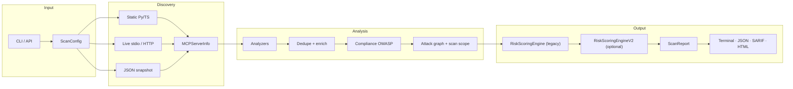

# Architecture

> [Documentation](../index.md) → [Analysis](README.md)

How MCTS works internally: discovery → analyzers → scoring → report.

| Read this if you… | Jump to |
|-------------------|---------|
| Just want to scan | [Getting started](../get-started/getting-started.md) — skip this doc |
| Need to understand a finding | [Security checks](security-checks.md) |
| Are contributing code | [Quick start for contributors](../../CONTRIBUTING.md#quick-start-for-first-time-contributors) + [Extension points](#extension-points) |
| Are debugging a scan | [Scan lifecycle](#scan-lifecycle) + [Debugging](#debugging-scans) |

> Terms: [Glossary](../glossary.md)

---

## On this page

1. [At a glance](#at-a-glance)
2. [End-to-end pipeline](#end-to-end-pipeline)
3. [Entry points](#entry-points)
4. [Scan lifecycle](#scan-lifecycle)
5. [Core data models](#core-data-models)
6. [Layers](#layers)
7. [Analyzers](#analyzers)
8. [Scoring and reporting](#scoring-and-reporting)
9. [Supporting commands](#supporting-commands)
10. [Package layout](#package-layout)
11. [Extension points](#extension-points)
12. [Debugging scans](#debugging-scans)

Roadmap and planned work: [Product roadmap](../more/roadmap.md) (not covered here).

---

## At a glance

When you run `mcts scan ./server.py`:

1. **Discover** — Build an `MCPServerInfo` snapshot (tools, prompts, resources, handler source, repo markdown instructions, optional live schemas)
2. **Analyze** — Run security analyzers; each returns `Finding` objects
3. **Post-process** — Dedupe, enrich with MCTS-T IDs, append OWASP compliance meta-findings
4. **Score** — Legacy 0–100 `score.overall` (always) plus v2 `score_v2` when `scoring_mode` is `v2` or `both` (default); compliance excluded from both sums; `attack_chains` meta-rows excluded from v2 only
5. **Report** — Terminal UI, JSON, SARIF (incl. `mcts/scoreV2`), or HTML via `mcts report`

**Orchestrator:** `Scanner` in `src/mcts/core/scanner.py`  
**Config:** `ScanConfig` in `src/mcts/core/config.py`  
**CLI:** `mcts scan` in `src/mcts/cli/main.py`

---

## End-to-end pipeline



ASCII equivalent:

```
ScanConfig ──► Discovery (static / live / snapshot) ──► MCPServerInfo
                              │
                              ▼
                    Analyzers (parallel, sequential loop)
                              │
                              ▼
              filters → dedupe → enrich (MCTS-T) → compliance
                              │
                              ▼
              attack_graph + scan_scope (paths when v2/both)
                              │
                              ▼
         RiskScoringEngine (always) → RiskScoringEngineV2 (v2/both)
                              │
                              ▼
                    ScanReport → terminal · JSON · SARIF · HTML
```

---

## Entry points

| Surface | Module | Typical use |
|---------|--------|-------------|
| **CLI** | `cli/main.py` | `mcts scan`, `inventory`, `fuzz`, `vet`, `pentest` |
| **REST API** | `api/app.py` | `mcts serve` — same `Scanner`, JSON in/out |
| **Python API** | `core/scanner.py` | `Scanner(ScanConfig).run()` or `.analyze_server(info)` |
| **MCP server mode** | `mcp_server/` | `mcts-mcp` tools for IDE agents |

All scan paths converge on `Scanner.analyze_server(MCPServerInfo)`.

---

## Scan lifecycle

`Scanner.run()` discovers first; `Scanner.analyze_server()` runs the analysis pipeline (also used by API and tests with pre-built snapshots).

### 1. Discovery (`MCPClient.discover()`)

| Source | When | Module |
|--------|------|--------|
| Python static AST | Default repo/file scan | `discovery/static.py` |
| TypeScript/JS patterns | `--languages typescript` | `discovery/static_js.py` |
| **Repository markdown** | Default repo scan (`--discover-instructions`, on) | `discovery/instruction_files.py` |
| Live stdio MCP | `--live` | `discovery/live.py`, `probe/session.py` |
| Remote HTTP/SSE | `--url` | `probe/http_session.py` |
| Exported JSON | `--snapshot` | `discovery/static_json.py` |
| Client config launch | `--config` + `--server` | `discovery/live_config.py` |

Static + live can merge when `merge_static_live` is true (default). Repository markdown discovery merges with Python/JS static results via `discovery/static_merge.py`. See [Scanning overview](../scanning/README.md).

**Repository instruction discovery** (`discovery/instruction_files.py`) walks the scan target for agent prompt content outside MCP `prompts/list`:

| Pattern | Loaded as |
|---------|-----------|
| `**/SKILL.md` | Prompt surface + `agent_skills` entry (for `skill_md`) |
| `**/*prompt*.md`, `**/system_prompt.md` | Prompt and/or instruction surfaces |
| `skills/`, `agent/skills/` | Project-local skill roots (no symlink required) |

Explicit paths: `--instruction-file`, `--instruction-glob`, `--skills-dir`. Disabled with `--no-discover-instructions`. Skipped when `--live`, `--url`, or `--snapshot` is used (MCP protocol takes precedence).

### 2. Attach runtime context

- Merge `--runtime-events` file rows with live / behavioral probe events
- Attach `surface_scan` options (`--surfaces`, MIME allowlist)
- Emit `discovery_meta` findings if live discovery was incomplete

### 3. Run analyzers

Loop registered analyzers; skip disabled or filtered ones (`--analyzers`, config toggles). When `--surface-scoped-analyzers` is on (default) and `--surfaces` is a strict subset, only analyzers relevant to those surfaces run — e.g. `mcts scan-prompts` skips `supply_chain` on `pyproject.toml`. See [Analyzers](#analyzers) and `core/surface_analyzers.py`.

Optional: `probe_protocol_security()` when `--protocol-probe` + `--url`.

### 4. Post-process findings

| Step | Function | Purpose |
|------|----------|---------|
| Filter | `_apply_filters()` | `--tool-filter`, `--analyzer-filter`, `--severity-filter`, `--technique` |
| Metadata dedupe | `dedupe_metadata_findings()` | Collapse duplicate metadata hits |
| Sigma dedupe | `dedupe_sigma_findings()` | Collapse duplicate Sigma matches |
| Enrich | `enrich_findings()` | Attach `technique_id`, `mitigation_ids`, crosswalk evidence |
| Compliance | `ComplianceChecker.check()` | OWASP LLM + MCP meta-findings (**non-scoring**) |

### 5. Attack graph and scan scope

Before scoring: `attack_graph` (with `paths` when chains ran) and `scan_scope` are set. Under v2/both, `AttackChainAnalyzer` always runs (whitelist/surface bypass).

### 6. Score and verify

1. `RiskScoringEngine.score()` → legacy `ScoreBasis`; `verify()` regression guard (always).
2. When `scoring_mode` is `v2` or `both`: `build_scoring_context()` → `RiskScoringEngineV2.score()` → optional `score_v2`; `verify()` on deterministic core.

### 7. Build `ScanReport`

Includes canonical `attack_graph`, optional `score_v2`, partitioned legacy `score_breakdown`, scan scope notes, and `analyzers_executed` audit list.

Optional: `--save-baseline` writes tool metadata snapshot for rug-pull detection on future scans.

---

## Core data models

Defined in `mcp/models.py` and `reporting/models.py`.

### MCPServerInfo

The **single input** every analyzer receives.

| Field | Purpose |
|-------|---------|
| `tools`, `prompts`, `resources` | MCP surfaces with schemas and text |
| `instructions` | Server system instructions when exposed |
| `instruction_sources` | Source paths for repo-discovered system instruction markdown |
| `agent_skills` | Discovered `SKILL.md` files (`name`, `path`, `content`) for `skill_md` |
| `source_files` | Path → content cache for SAST |
| `runtime_events` | Telemetry rows for runtime analyzers |
| `discovery_mode` | `static`, `live`, `merged`, `static+instruction-files`, `instruction-files`, etc. |
| `surface_scan` | Per-scan surface and MIME options |

### MCPPrompt (key fields)

| Field | Purpose |
|-------|---------|
| `name`, `description` | Prompt metadata or full markdown body when repo-discovered |
| `source_file`, `source_line` | Path to `SKILL.md`, `*prompt*.md`, etc. |
| `discovered_via` | `mcp`, `skill-md`, or `instruction-file` |

### MCPTool (key fields)

| Field | Purpose |
|-------|---------|
| `name`, `description`, `input_schema` | Tool metadata |
| `handler_snippet`, `source_file`, `source_line` | Static SAST context |
| `capability` | `CapabilityProfile` for attack chains |

### Finding

| Field | Purpose |
|-------|---------|
| `analyzer` | Source check (e.g. `permission_analyzer`) |
| `severity` | `critical` / `high` / `medium` / `low` |
| `technique_id` | MCTS-T-* (after enrichment) |
| `evidence`, `location` | Proof and source line |
| `tool` | Related tool name when applicable |

### ScanReport

| Field | Purpose |
|-------|---------|
| `findings`, `summary` | All issues and severity counts |
| `score` | Overall score + auditable `basis` |
| `server` | Full discovery snapshot |
| `attack_graph` | Capability-graph paths for UI |
| `analyzers_executed` | Which checks ran |

Full field lists: source models in `reporting/models.py`.

---

## Layers

### Discovery (`discovery/`, `mcp/client.py`)

Turns a filesystem path, live process, or JSON file into `MCPServerInfo`.

| Module | Role |
|--------|------|
| `static.py` | Python `@tool` AST, schemas, handler snippets |
| `static_js.py` | TS/JS registerTool / handler patterns |
| `static_merge.py`, `static_runner.py` | Multi-language repo walks |
| `live.py`, `live_config.py` | Stdio / config-based live probe |
| `static_json.py` | Air-gapped snapshot load |
| `merge.py` | Static + live merge |
| `env_expand.py`, `json5_util.py` | IDE config parsing |

Guides: [Live](../scanning/live-scanning.md) · [Remote](../scanning/remote-scanning.md) · [Snapshot](../scanning/static-snapshot.md) · [TypeScript](../scanning/typescript-discovery.md)

### Probe (`probe/`)

Transport, consent, and event extraction for live modes.

| Module | Role |
|--------|------|
| `session.py` | Async stdio MCP session |
| `http_session.py` | Streamable HTTP / SSE |
| `auth.py` | Bearer, headers, OAuth client credentials |
| `consent.py` | `--i-understand-live-risk` / `MCTS_LIVE_OK` |
| `behavioral.py`, `events.py` | Runtime event rows for analyzers |
| `protocol_checks.py` | Active MCPS HTTP checks |

### Orchestration (`core/scanner.py`)

Builds analyzer list in `_build_analyzers()`, runs lifecycle above. Filters and technique mode applied after analyzers complete.

### Analyzers (`analyzers/`)

See [Analyzers](#analyzers) below.

### Taxonomy (`taxonomy/`)

| Asset | Role |
|-------|------|
| `techniques.json` | MCTS-T catalog |
| `mapper.py` | `enrich_findings()` |
| `crosswalk.json` | External framework IDs in evidence |
| `sigma/metadata_rules.json` | Bundled metadata Sigma rules |

### Scoring (`scoring/`)

Legacy exponential decay (`engine.py`); v2 multi-factor engine (`engine_v2.py`, `graph.py`, `chains.py`, packaged corpus stats). Compliance excluded from both; `attack_chains` meta-rows excluded from v2 sum. Details: [Scoring spec](../reporting/scoring-spec.md) · [Scoring v2](../reporting/scoring-spec-v2.md).

### Reporting (`reporting/`, `report/`, `ui/`)

| Output | Path |
|--------|------|
| JSON / SARIF | `reporting/models.py`, `reporting/sarif.py` |
| Terminal | `ui/dashboard.py`, themes in `ui/theme.py` |
| HTML | `report/generators/html_report.py` |

---

## Analyzers

All analyzers implement `BaseAnalyzer.analyze(server: MCPServerInfo) -> list[Finding]` (`analyzers/base.py`).

Registered in `Scanner._build_analyzers()`. User-facing descriptions: [Security checks](security-checks.md).

### Always registered (core)

Run unless disabled by `_is_enabled()` or `--analyzers` subset.

| Key | Focus |
|-----|-------|
| `permission_analyzer` | Destructive / high-risk tool names and descriptions |
| `metadata_integrity` | Description poisoning patterns |
| `prompt_injection` | Injection heuristics in metadata |
| `tool_shadowing` | Duplicate tool names within server |
| `line_jumping` | Context precedence attacks |
| `tool_abuse` | Path traversal in metadata |
| `schema_surface` | Full schema poisoning (FSP) |
| `data_leakage` | Secrets in source + metadata |
| `command_execution` | Shell/exec in handlers |
| `path_validation` | Missing path checks |
| `runtime_events` | Telemetry cluster (delegates to sub-detectors) |
| `sigma_metadata` | Bundled + custom Sigma YAML |
| `oauth_config` | OAuth misconfiguration |
| `supply_chain` | Dependency posture heuristics |
| `skill_md` | Agent `SKILL.md` patterns (W007–W014) when repo skills discovered |

### Default-on (config toggles)

| Key | Toggle | Focus |
|-----|--------|-------|
| `surface_metadata` | `enable_surface_metadata` (default on) | Multi-surface poisoning |
| `prompt_defense` | `enable_prompt_defense` (default on) | Missing defensive language |
| `skill_md` | always registered | `SKILL.md` W007–W014 when `agent_skills` populated |
| `behavioral_static` | `enable_behavioral_static` (default on) | Description vs handler + taint |
| `jailbreak` | `enable_jailbreak` (default on) | Manipulation resistance |
| `attack_chains` | `enable_attack_chains` (default on) | Capability-graph BFS |

### Conditional on inputs

| Key | Enabled when |
|-----|--------------|
| `metadata_diff` | `--baseline` provided |
| `embedding_secrets` | `--semantic-secrets` |
| `cross_server` | Inventory with ≥2 servers (e.g. `inventory --scan`) |
| `toxic_flows` | Inventory with ≥2 servers + `--full-toxic-flows` |

### Opt-in (flags / extras)

| Key | Flag | Notes |
|-----|------|-------|
| `vulnerable_package` | `--pip-audit` | Requires `supplychain` extra |
| `npm_audit` | `--npm-audit` | npm audit subprocess |
| `yara_metadata` | `--yara` | Requires `yara` extra |
| `llm_judge` | `--llm-judge` | Requires `MCTS_LLM_API_KEY` |
| `llm_metadata_triage` | `--llm-triage` | malicious / safe / suspect |
| `semgrep_sast` | `--semgrep` | Requires `semgrep` CLI on PATH |
| `cloud_inspect` | `--cloud-inspect` | Requires cloud API key |
| `virustotal` | `--virustotal` | Hash lookup |

### Multi-surface iteration

`analyzers/surfaces.py` defines `ScanSurface` for tools, prompts, resources, and instructions. Surface-aware analyzers iterate via `scan_surfaces(server)`. Repo-discovered markdown is loaded into `prompts` / `instructions` before surface iteration, so `prompt_injection`, `jailbreak`, and `prompt_defense` analyze real file content — not only MCP `prompts/list` from live probes.

### Behavioral SAST (`sast/`)

Used by `behavioral_static`. Python AST taint + optional tree-sitter for TS/Go/Rust. Semgrep rules in `sast/semgrep/rules/`. Install deep parsers: `uv sync --extra sast`.

### Runtime sub-detectors

`RuntimeEventsAnalyzer` routes telemetry rows to focused modules (e.g. `rug_pull.py`, `command_injection.py`, `tool_redefinition.py`). Technique mapping: [Threat taxonomy](../reporting/taxonomy.md) and `tests/fixtures/regression/MCTS-T-*/`.

### Attack chains (`capability/`, `analyzers/attack_chains.py`)

`capability/inferrer.py` assigns per-tool flags (`reads_untrusted_input`, `egresses_network`, `executes_commands`, …). BFS finds paths like read → exfiltrate. Graph stored on `ScanReport.attack_graph`.

When `scoring_mode` is `v2` or `both`, paths are built at scan time via `scoring/graph.build_paths()` and stored on the canonical graph:

```json
{
  "nodes": [{"id": "read_file", "label": "read_file", "type": "tool"}],
  "edges": [{"from": "read_file", "to": "send_webhook", "label": "read→exfil"}],
  "paths": [{
    "id": "path-chain-credential-theft-2",
    "nodes": ["read_file", "get_env", "send_webhook"],
    "tools_on_path": ["read_file", "get_env", "send_webhook"],
    "hop_count": 2,
    "finding_ids": ["chain-credential-theft"]
  }]
}
```

`hop_count` is validated edge hops only (`len(nodes) - 1`). Scanner, v2 engine, and HTML dashboard all use `canonical_attack_graph(report)` (invariant I3/I11).

---

## Scoring and reporting

### Legacy engine (`scoring/engine.py`)

Always runs. Populates `ScanReport.score` (invariant I1).

| Metric | Formula | Notes |
|--------|---------|-------|
| Raw risk | C×25 + H×10 + M×3 + L×1 | Linear weighted sum |
| Overall score | `round(100 × e^(-raw/50))` | Higher is better |
| Risk index | `min(100, raw_risk)` | Higher is worse |

`compliance` analyzer findings are **informational only** — they do not affect legacy or v2 sums.

### v2 engine (`scoring/engine_v2.py`)

Runs when `scoring_mode` is `v2` or `both` (default). Populates `ScanReport.score_v2`.

Pipeline order (PR-1e): analyzers → compliance → **attack graph + scan scope** → legacy score → `build_scoring_context()` → v2 score. Canonical graph stored on report (I11).

| Output | Notes |
|--------|-------|
| `absolute_risk` | Multi-factor bracket sum × `chain_factor` on tool-attributed findings |
| `security_score` | Corpus percentile (packaged `scoring_v2_corpus_stats.json`) |
| `dimension_scores` | Eight RFC factor axes for radar chart |
| `top_contributors` | Finding + attack-chain explainability rows |
| `category_scores_v2` | OWASP tiles (100=good), separate from legacy categories |

`attack_chains` meta-findings appear in the report but are **excluded** from v2 sum (`NON_SCORING_V2`). Chain signal is `chain_factor` on tool rows via `scoring/chains.py` and `scoring/graph.py`.

Gates: `governance/scan_gates.py` (CLI exit codes + API `gate_violations`). Docs: [Scoring developer guide](../reporting/scoring-guide.md) · [v2 spec](../reporting/scoring-spec-v2.md).

### Report outputs

- **Terminal** — Rich dashboard (`ui/`) — legacy + v2 lines when `both`
- **JSON** — full `ScanReport` with optional `score_v2`
- **SARIF** — `--format sarif`; run-level `mcts/scoreV2` when v2 present
- **HTML** — `mcts report` executive dashboard with v2 primary header

---

## Supporting commands

These share discovery/models but use separate entry paths:

| Command | Module | Role |
|---------|--------|------|
| `mcts fuzz` | `fuzz/` | Protocol probes → `runtime_events` JSON |
| `mcts inventory` | `inventory/` | Client config discovery; feeds cross-server / toxic-flow analyzers |
| `mcts vet` | `vet/` | Pre-install PyPI/npm/OCI checks |
| `mcts pentest` | `pentest/` | Structured recon + attack chains; `absolute_risk` + v2 `risk_level` verdict when v2/both |
| `mcts readiness` | `readiness/` | HEUR-001–020 (separate from security score) |
| `mcts serve` | `api/` | REST wrapper around `Scanner` |

---

## Package layout

```
src/mcts/
├── cli/           # Typer commands and flag wiring
├── core/          # Scanner, ScanConfig, target resolution
├── mcp/           # MCPServerInfo models, MCPClient.discover()
├── discovery/     # Static, live, snapshot, merge
├── probe/         # Live transport, consent, behavioral events
├── analyzers/     # Security checks (subclass BaseAnalyzer)
├── sast/          # Taint analysis + Semgrep rule pack
├── capability/    # Tool capability profiles
├── scoring/       # engine.py (v1), engine_v2.py, graph.py, chains.py, corpus stats
├── compliance/    # OWASP mapping (non-scoring)
├── taxonomy/      # MCTS-T/M, Sigma, crosswalk, enrichment
├── reporting/     # Pydantic models, SARIF
├── report/        # HTML dashboard templates
├── ui/            # Terminal Rich UI
├── inventory/     # Client config + skills discovery
├── fuzz/          # Fuzz runner
├── vet/           # Package vetting
├── pentest/       # Pentest phases
├── governance/    # policy.py, scan_gates.py (legacy + v2 YAML/CLI gates)
├── readiness/     # Production heuristics + OPA
├── api/           # FastAPI (mcts serve)
├── mcp_server/    # mcts-mcp stdio tools
├── output/        # Analysis dir, history, artifacts
└── testing/       # Regression harness
```

---

## Extension points

### Add an analyzer

1. Create `src/mcts/analyzers/your_check.py`:

```python
from mcts.analyzers.base import BaseAnalyzer
from mcts.mcp.models import MCPServerInfo
from mcts.reporting.models import Finding, Severity

class YourAnalyzer(BaseAnalyzer):
    name = "your_check"

    def analyze(self, server: MCPServerInfo) -> list[Finding]:
        ...
```

2. Register in `Scanner._build_analyzers()` (`core/scanner.py`).
3. Add CLI flag in `cli/main.py` + field on `ScanConfig` if opt-in.
4. Add tests in `tests/`; regression fixture under `tests/fixtures/regression/MCTS-T-*/` when adding a technique.
5. Document in [Security checks](security-checks.md).

If the check needs inventory context, pass `inventory=` like `OAuthConfigAnalyzer`.

### Add a runtime detector

Add a module under `analyzers/` and wire it from `RuntimeEventsAnalyzer` (`runtime_events.py`) for the relevant event types.

### Add discovery for a language

Extend `discovery/static_runner.py` and add a parser module (see `static_js.py` pattern).

### Add a Semgrep rule

Add YAML under `sast/semgrep/rules/`; map `metadata.technique_id` to MCTS-T.

Contributor quick start: [CONTRIBUTING.md](../../CONTRIBUTING.md#quick-start-for-first-time-contributors)

---

## Debugging scans

| Symptom | Where to look |
|---------|---------------|
| No tools discovered | Discovery logs; try `--auto`; check `--languages`, exclude dirs |
| Score seems wrong | Legacy: `score.basis` in JSON. v2: `score_v2.basis` + `top_contributors`. Compliance non-scoring; `attack_chains` meta-rows excluded from v2 only. Dual scores diverging is expected — see [Scoring developer guide](../reporting/scoring-guide.md). |
| Analyzer missing from report | `analyzers_executed` on `ScanReport`; check `--analyzers` subset and opt-in flags |
| Live scan incomplete | `discovery_warnings` → `live_discovery` findings; `--strict-live` |
| False positive | Analyzer module + fixture in `tests/fixtures/regression/` |
| Technique ID missing | `taxonomy/mapper.py` catalog + `enrich_findings()` |

**Useful commands:**

```bash
uv run mcts scan ./server.py -o /tmp/report.json
uv run python -c "import json; r=json.load(open('/tmp/report.json')); print(r['analyzers_executed'])"
uv run pytest tests/test_scanner.py -q
uv run pytest tests/fixtures/regression/ -q   # if applicable
```

---

## Related

- [Security checks reference](security-checks.md) — what each analyzer looks for
- [Scoring specification](../reporting/scoring-spec.md) (legacy)
- [Scoring v2](../reporting/scoring-spec-v2.md) · [Migration](../migration/scoring-v2.md)
- [Threat taxonomy](../reporting/taxonomy.md)
- [CLI reference](../platform/cli.md)
- [CONTRIBUTING.md](../../CONTRIBUTING.md)
